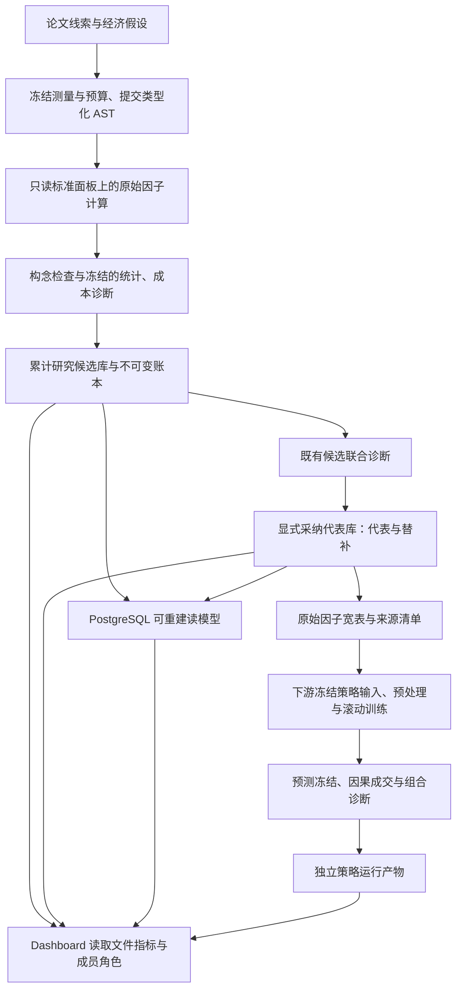

# Factor Miner 系统架构

这份文档说明系统如何运行；若需要快速理解项目价值和面试讲法，先读 [README](README.md) 与 [项目面试讲解](docs/项目面试讲解.md)。

## 研究目标与结论边界

Factor Miner 将金融假设、因子计算、组合研究和结果发布分层，保留可追溯的研究事实。系统从可核验的论文与经济假设出发，经公式构建、真实计算、预测与交易检验，再到冗余分析和特征交付；成员采纳不改变候选的原统计资格。

日常使用见 [当前流程与日常使用](docs/当前流程与日常使用.md)，全部合同见 [文档索引](docs/README.md)。

## 核心数据流



探索协议 `favor-exploration-v1` 与原 FaVOR 联合确认分别路由；后者的 AND 和三档方向选择性不构成所有探索的准入门槛。两者也不被普通 Ridge 或代表库采纳替代。

## 分层职责

| 层 | 输入 | 输出 | 关键不变量 |
| --- | --- | --- | --- |
| 假设与测量 | 可核验来源、数据可行性与事前主张 | 类型化测量、候选预算与 Spec | 先冻结再评价；历史结果不伪装为事前假设 |
| DSL 与编译 | `CandidateSpec`、类型化 AST | 规范 AST、字段与窗口、确定性计划哈希 | 白名单算子、无未来函数、无任意 Python |
| 原始计算 | 只读行情、状态表、字段注册表 | 原始因子面板 | 只使用观察时点可得数据，不做截面预处理 |
| 评价 | 原始因子、冻结标签与政策 | IC、RankIC、HAC、多重检验结果 | 股票池、掩码、切分和统计族事前冻结 |
| 诊断 | 既有候选、冻结分组与模型政策 | 全池相关、删除实验、重训子集 Shapley、组合报告 | 共同截面、标签事件 purge；不按贡献正负自动淘汰 |
| 成员采纳 | 已完成联合诊断与代表映射 | 独立代表库、成员角色及默认输入清单 | 不删除替补，不改原统计资格，不自动重训下游 |
| 存储与展示 | 不可变运行产物 | JSON/JSONL、PostgreSQL 投影、Dashboard | 文件产物为事实源，数据库可删除重建 |

## 代码结构

```text
src/factor_miner/
├── schema.py / dsl.py / compiler.py       # 候选合同、白名单 AST、确定性编译
├── compute.py / evaluation.py             # 原始计算与冻结评价
├── statistics.py / redundancy.py          # HAC、多重检验与冗余
├── incremental.py                         # 相对冻结参考库的增量信息
├── joint_study.py / joint_contribution.py  # 联合诊断登记、相关、删除实验与组归因
├── joint_library.py                       # 完成诊断的成员采纳与显式查询
├── favor_api.py                          # 有限 API 生成、响应录制与共同验证
├── feature_export.py                      # 审核身份校验、原始宽表与来源清单导出
├── ridge_strategy.py / causal_backtest.py  # 独立策略配置、滚动拟合与因果成交
├── coverage_*.py / semantic_coverage.py   # 结构与信号双层图谱、覆盖缺口
├── llm_*.py                               # 脱敏、授权、审批与模型调用记录
├── research_memory.py                     # 跨轮次不可变研究记忆
├── research_*.py / lightweight_*.py       # 研究族编排与轻量自进化
├── portfolio_*.py / barra_*.py            # 组合和风险归因诊断
├── ledger.py / *_artifacts.py             # 哈希链账本与原子发布
└── cli.py                                 # 正式命令行入口
```

## 运行与数据环境

真实研究可在本地电脑或服务器运行，不依赖 SSH、Linux 或特定个人数据目录。所有市场先映射为标准 `market/state/label` 三表；A 股的停牌、ST、涨跌停和美股的退市、交易时段等差异，在数据适配层转换成统一的计算、排名和交易 mask。

每次运行都记录 release、manifest SHA-256、Schema、截止日、复权、交易日历、状态表、代码提交和配置哈希。输入发布只读使用，产物写入独立目录；任一身份缺失或不一致都必须在读取结果前失败。

文件型 CLI 研究与本地报告可以独立运行；完整数据库发布使用显式市场 DSN。数据库只保存可重建投影，不参与候选身份、研究预算或不可变账本的最终裁决。

## 代表库与界面的关系

`joint_library.py` 在加载时校验成员清单、完成回执、小型诊断快照及源累计库身份。`list-joint-library` 默认返回代表，显式选项才包含替补；查询本身不训练模型。

A 股 profile 的 `cost_review_path` 定位累计候选指标，`joint_library_path` 定位角色覆盖层。`dashboard/favor_cost_page.py` 合并两者后呈现代表、替补或全部；`dashboard/app.py` 提供独立“研究代表库”入口。界面默认市场由 profile 选择规则决定，不由成员数量决定。

`src/factor_miner_pg/joint_library_store.py` 只发布 `factor_library_members` 与 `factor_library_active`；原 `favor_research_candidates` 保留基础指标与资格，正式因子表不因采纳而新增记录。

## 复现与证据边界

代表名单由无本轮收益选择的相关与覆盖规则确定；Ridge/删除/Shapley 是组合诊断。普通预测 Ridge 不等于 Ridge-SDF，本版不声称完整复现 SPPC。旧区间的重新滚动拟合不消除历史筛选偏差。

实际终值未知时，实际指标保持空值，最后报价参考与零回收情景分别发布。全池与精简池使用共同日期、股票池与成交口径；Shapley 近似误差与日期分块不确定性分开保存。

采纳库保留足够的成员和小型报告快照供日常查询；完整重放仍依赖源矩阵、原诊断和共享缓存。Git 合并不会迁移这些真实产物，不能把代码合并当成删除旧运行或 Worktree 的依据。

## 扩展边界

- 新因子必须通过现有 `CandidateSpec`、compiler、evaluator 和统计协议，不能加入任意 Python 插件口。
- 新数据源必须实现同一独立数据合同，不能在运行时 import 其他个人量化项目。
- 新模型只能替换受控假设或表达式生成角色，不能修改评价规则、试验预算或结果。
- 项目内 Skill 只服务开发代理，删除后 CLI 和完整研究流程仍须可运行。

## 网页 API 研究入口

`dashboard/api_workbench.py` 提供计划表单、任务进度和配置，`api_connection.py` 派发后台 `run-favor-api` CLI。`favor_api.py` 校验冻结身份、调用既有录制供应商，再进入 `submit-favor` 与 `run-favor`。密钥只通过子进程环境传递；一次派发和阶段边界停止覆盖两市场。审核状态由已采纳成员覆盖层展示，原统计字段保持原样。详见[API 研究指南](docs/runbooks/Dashboard的API研究与审核状态.md)。
